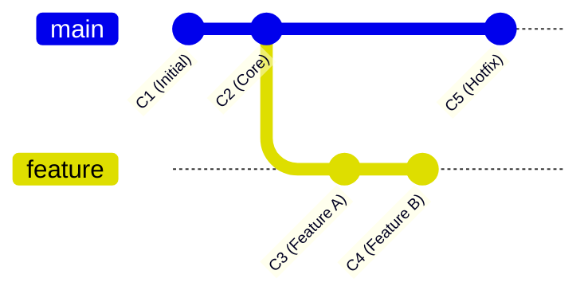

# Lecture Guide: Cloud Computing & Version Control (Git, GitHub, & GitLab)

- **Topic:** UI Designing Fundamentals & Real-Time Application

- **Instructor: RAHUL KP**

## Lecture Breakdown

| Topic / Activity                | Key Teaching Notes                                                         |
| :------------------------------ | :------------------------------------------------------------------------- |
| **Foundations & Principles**    | Explain Centralized vs Distributed using whiteboard diagrams.              |
| **Environment & Setup**         | Walk through `git config` and GUI vs CLI tradeoffs.                        |
| **Local Operations & 3-Trees**  | Live demo: `init`, `add`, `status`, and `commit`.                          |
| **Branching & Merge Conflicts** | **Live Demo:** Deliberately trigger and manually resolve a merge conflict. |
| **Workflows & Cloud PRs/MRs**   | Contrast **GitHub Flow** vs **GitFlow** for different team sizes.          |
| **Q&A & Wrap-Up**               | Summarize key commands and flow selection rules.                           |

## 1: Foundations of Version Control

### What is Git, GitHub, and GitLab?

- **Git:** A local, distributed version control system (DVCS) software running on your command line or GUI. It tracks local changes in code repositories.
- **GitHub & GitLab:** Cloud-hosted web platforms providing remote storage for Git repositories, alongside CI/CD pipelines, issue tracking, and code review tools.

### Brief History of Git

- **2005:** Created by **Linus Torvalds** (creator of Linux) in response to the BitKeeper VCS revoking free licenses for the Linux kernel project.
- Torvalds built Git in a few weeks with speed, data integrity, and non-linear development as core goals.

### Core Design Principles

1. **Speed & Efficiency:** Near-instantaneous local operation.
2. **Distributed Architecture:** Every developer maintains a full local clone of the entire repository history.
3. **Data Integrity:** Everything is cryptographically verified using SHA-1 (or SHA-256) hashes. Changes are immutable.
4. **Non-linear Development:** Lightweight, frictionless branching and merging.

### Centralized (CVCS) vs. Distributed (DVCS)

%20vs.%20Distributed%20(DVCS).png>)

## 2: Setup & Environment Configuration

#### 1. Installing Git

- **Windows:**
  - Download the official installer from [git-scm.com](https://git-scm.com).
  - Run the executable. During setup, select **Git Bash** (included by default) to get a Unix-like terminal environment alongside command-line tools.
  - _Alternative via Windows Terminal / winget:_
    ```powershell
    winget install --id Git.Git -e --source winget
    ```

- **macOS:**
  - _Via Xcode Command Line Tools (Simplest):_ Open Terminal and run:
    ```bash
    xcode-select --install
    ```
  - _Via Homebrew (Recommended for updates):_
    ```bash
    brew install git
    ```

- **Linux:**
  - _Debian / Ubuntu:_
    ```bash
    sudo apt update
    sudo apt install git-all
    ```
  - _Fedora / RHEL:_
    ```bash
    sudo dnf install git
    ```
  - _Arch Linux:_
    ```bash
    sudo pacman -S git
    ```

---

#### 2. Verification

Verify that Git was successfully installed by checking its version in your terminal:

```bash
git --version

```

## 3: Local Git Architecture & File Management

### The 3-Trees Architecture & File States


### Essential CLI Operations Matrix

| Command               | Operational Purpose                                      |
| --------------------- | -------------------------------------------------------- |
| `git init`            | Initializes a new, empty Git repository (`.git` folder). |
| `git status`          | Displays file states (untracked, modified, staged).      |
| `git add <file>`      | Stages changes for the next commit snapshot.             |
| `git commit -m "msg"` | Captures a permanent snapshot of the staging area.       |
| `git log --oneline`   | Displays chronological commit history.                   |
| `git diff`            | Shows unstaged changes relative to the index.            |

---

## Module 4: Branching, Merging & Pull Requests (30 Mins)

### What is a Branch?

In Git, a **branch** is simply a lightweight, movable pointer to a specific commit. The default pointer is usually `main` or `master`. `HEAD` is a special pointer referencing your current active branch/commit.



### Branch Naming Conventions

Maintain a clean repository structure with strict branch categories:

- `feature/feature-name` (e.g., `feature/user-auth`)
- `bugfix/issue-description` (e.g., `bugfix/login-padding`)
- `hotfix/critical-patch` (e.g., `hotfix/security-jwt`)
- `release/version` (e.g., `release/v2.1.0`)

---

## 5: Team Workflows & Strategy (25 Mins)

### 1. Centralized Workflow

- **Use Case:** Small teams, simple linear history, single-developer projects.
- **Mechanism:** Everyone commits directly to the `main` branch. High collision risk for larger teams.

### 2. GitHub Flow

- **Use Case:** Web apps, continuous deployment (CD), agile fast-paced teams.
- **Mechanism:** Anything in `main` is deployable. Create short-lived feature branches, submit PRs, test, and merge directly to `main`.


### 3. GitFlow Architecture

- **Use Case:** Enterprise software, scheduled releases, version-controlled APIs (e.g., mobile apps, desktop apps).
- **Branch Roles:**
- `main`: Production-ready code only.
- `develop`: Integration branch for functional testing.
- `feature/*`: Isolated feature work off `develop`.
- `release/*`: Preparation/testing for upcoming production releases.
- `hotfix/*`: Emergency patches directly targeting `main`.


