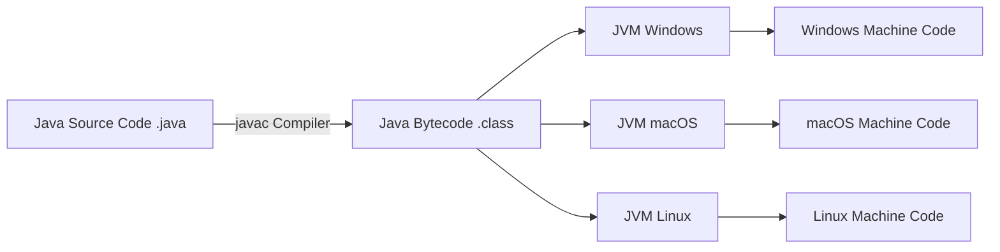
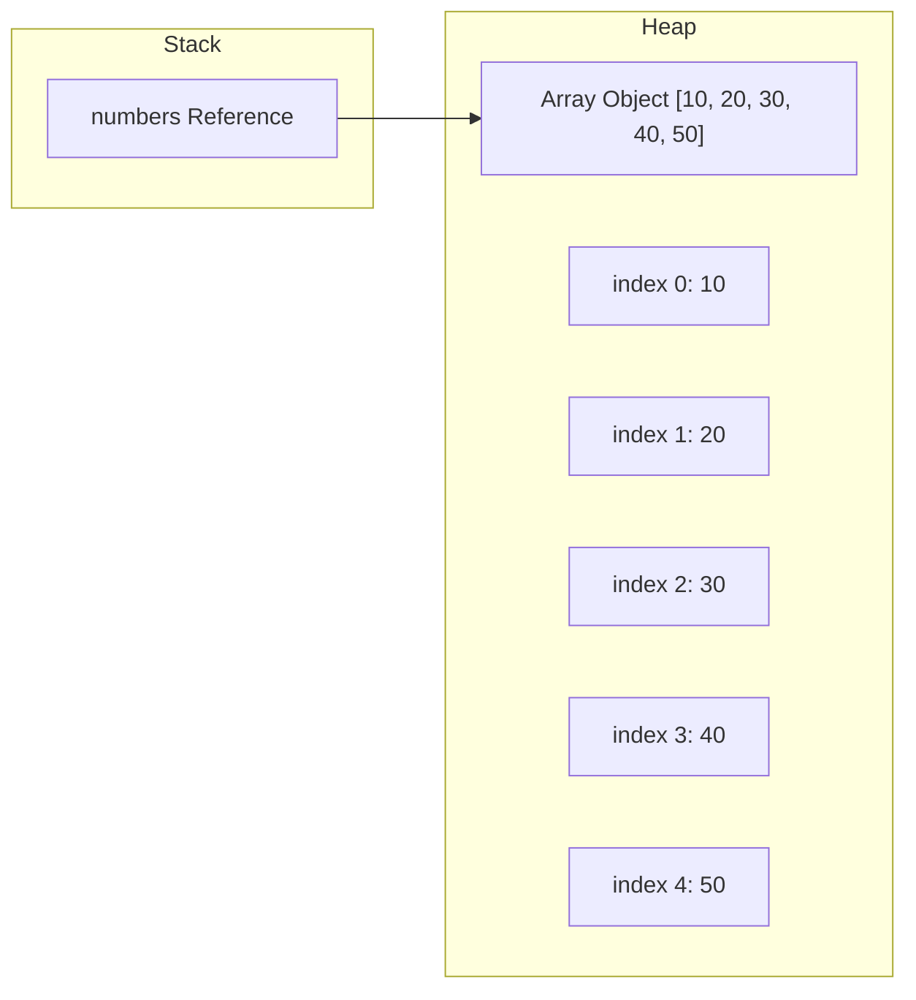

# Lecture Guide: Java Fundamentals & Arrays

**Target Duration:** 120 Minutes (2 Hours)

**Level:** Introductory

---

## IDE Tools – (Installing & Features)

Installing **JDK 17 (or higher)** varies by operating system. Below are step-by-step instructions using standard package managers and official installers for Windows, macOS, and Linux, followed by verification and environment setup.

---

### 1. Install JDK on Windows

**Method 1: Windows Package Manager (Fastest)**

Open PowerShell or Command Prompt as Administrator and run:

```powershell
winget install EclipseAdoptium.Temurin.17.JDK

```

**Method 2: Manual Installer**

1. Download the x64 Windows Installer (.msi) from [Adoptium Temurin 17](https://adoptium.net/temurin/releases/?version=17) or [Oracle JDK 17](https://www.google.com/search?q=https://www.oracle.com/java/technologies/downloads/%23java17).
2. Run the `.msi` setup file.
3. During installation, make sure **"Set JAVA_HOME variable"** and **"Add to PATH"** are selected.

---

### 2. Install JDK on macOS

**Method 1: Homebrew (Recommended)**

Open Terminal and run:

```bash
brew install openjdk@17

```

After installation, symlink it so the system can find it:

```bash
sudo ln -sfn $(brew --prefix)/opt/openjdk@17/libexec/openjdk.jdk /Library/Java/JavaVirtualMachines/openjdk-17.jdk

```

**Method 2: Manual Installer (.pkg)**

1. Download the macOS `.pkg` installer (choose **macOS x64** for Intel Macs or **macOS aarch64** for Apple Silicon / M-series Chips) from [Adoptium Temurin 17](https://adoptium.net/temurin/releases/?version=17).
2. Open the file and complete the setup wizard.

---

### 3. Install JDK on Linux

**Debian / Ubuntu:**

```bash
sudo apt update
sudo apt install openjdk-17-jdk

```

**Fedora / RHEL / CentOS:**

```bash
sudo dnf install java-17-openjdk-devel

```

**Arch Linux:**

```bash
sudo pacman -S jdk17-openjdk

```

---

### 4. Verify Installation

Open a fresh terminal or command prompt window and run:

```bash
java -version

```

**Expected Output:**

```text
openjdk version "17.0.x" ...
OpenJDK Runtime Environment ...

```

Also check the compiler:

```bash
javac -version

```

---

### 5. Configure JAVA_HOME (Optional / Recommended)

Setting `JAVA_HOME` ensures tools like Eclipse, Maven, or Gradle locate the JDK installation properly.

**Windows (PowerShell):**

```powershell
[System.Environment]::SetEnvironmentVariable("JAVA_HOME", "C:\Program Files\Eclipse Adoptium\jdk-17.x.x-hotspot", "User")

```

**macOS / Linux (`~/.zshrc` or `~/.bashrc`):**

```bash
export JAVA_HOME=$(java -e 'System.out.println(System.getProperty("java.home"));' 2>/dev/null || echo "/usr/lib/jvm/java-17-openjdk")
export PATH=$JAVA_HOME/bin:$PATH

```

Run `source ~/.zshrc` or `source ~/.bashrc` to apply changes.

### Installing Eclipse IDE

1. **Prerequisite:** Ensure a Java Development Kit (JDK 17 or higher) is installed on your system.
2. **Download:** Obtain the official **Eclipse IDE for Java Developers** from [eclipse.org](https://www.eclipse.org/).
3. **Setup:** Run the installer, select **Eclipse IDE for Java Developers**, specify the installation path, and launch the IDE.
4. **Workspace Selection:** Choose a designated local folder to host your projects and configuration files.

### Key Features of Eclipse

- **Package Explorer:** Organizes source files (`.java`), compiled binaries (`.class`), and library dependencies logically.
- **IntelliSense / Content Assist:** Triggered using `Ctrl + Space` for auto-completing code constructs and methods.
- **Integrated Compiler:** Performs real-time syntax checking and flags compilation errors without requiring manual terminal compilation.
- **Built-in Debugger:** Allows setting breakpoints, stepping through lines (`F5` step into, `F6` step over), and inspecting variable states in runtime memory.
- **Code Generation:** Built-in tools for generating constructors, getters, setters, and overriding methods automatically.

---

## Overview & Features of Java

### The Java Virtual Architecture (WORA)

Java's core philosophy is **"Write Once, Run Anywhere" (WORA)**. Source code is not compiled directly into machine code for a specific CPU architecture. Instead, it compiles into platform-neutral **Bytecode** (`.class` files), which is executed by the **Java Virtual Machine (JVM)**.



### Core Features of Java

1. **Simple & Object-Oriented:** Eliminates complex low-level constructs like direct pointer arithmetic, while modeling solutions around classes and objects.
2. **Platform Independent:** The compiler produces bytecode, allowing identical binary execution across any system hosting a compliant JVM.
3. **Robust & Secure:** Employs explicit memory management via automatic **Garbage Collection (GC)** and enforces strict type checking at compile time.
4. **Multithreaded:** Native language-level support for concurrent thread execution.
5. **High Performance:** Utilizes **Just-In-Time (JIT)** compilation within the JVM to translate bytecode into native machine instructions at runtime for frequently executed code paths.

---

## Programming Structures in Java

### Data Types & Variables

Java is a strongly-typed language. Every variable must have an explicitly declared data type.

- **Primitive Types (Stored directly on the Stack):**
- Integers: `byte` (8-bit), `short` (16-bit), `int` (32-bit), `long` (64-bit)
- Floating-Point: `float` (32-bit), `double` (64-bit)
- Character: `char` (16-bit Unicode)
- Logical: `boolean` (`true` / `false`)

- **Reference Types (Stored on the Heap, references on Stack):**
- Classes, Interfaces, Arrays, Strings.

```java
public class PrimitiveExamples {
    public static void main(String[] args) {
        int studentAge = 21;
        double gpa = 3.85;
        char grade = 'A';
        boolean isEnrolled = true;

        System.out.println("Age: " + studentAge + ", GPA: " + gpa);
    }
}

```

### Operators

- **Arithmetic:** `+`, `-`, `*`, `/`, `%`
- **Relational:** `==`, `!=`, `>`, `<`, `>=`, `<=`
- **Logical:** `&&` (AND), `||` (OR), `!` (NOT)
- **Assignment & Shortcut:** `=`, `+=`, `-=`, `++`, `--`

### Control Flow Structures

#### 1. Conditional Branching (`if-else`, `switch`)

```java
int score = 85;

if (score >= 90) {
    System.out.println("Grade: A");
} else if (score >= 80) {
    System.out.println("Grade: B");
} else {
    System.out.println("Grade: C or below");
}

// Modern Switch Expression
String day = "MONDAY";
switch (day) {
    case "MONDAY", "FRIDAY" -> System.out.println("Weekday duty");
    case "SATURDAY", "SUNDAY" -> System.out.println("Weekend off");
    default -> System.out.println("Midweek day");
}

```

#### 2. Iteration Loops (`for`, `while`, `do-while`)

```java
// Standard For Loop
for (int i = 1; i <= 5; i++) {
    System.out.println("Count: " + i);
}

// While Loop
int count = 0;
while (count < 3) {
    System.out.println("While iteration: " + count);
    count++;
}

```

---

## Arrays in Java

### What is an Array?

An **Array** is a fixed-size, contiguous collection of homogeneous elements indexed by non-negative integers starting at `0`.

### Memory Model: Stack vs. Heap Allocation

In Java, arrays are treated as objects. The reference variable sits on the **Stack**, while the contiguous array elements reside in the **Heap** memory.



### 1D Array Declaration, Instantiation, & Traversal

```java
public class ArrayBasics {
    public static void main(String[] args) {
        // Declaration and Instantiation
        int[] numbers = new int[5]; // Allocates space for 5 integers (default initialized to 0)

        // Initialization
        numbers[0] = 10;
        numbers[1] = 20;
        numbers[2] = 30;
        numbers[3] = 40;
        numbers[4] = 50;

        // Alternative inline declaration
        int[] scores = {95, 88, 72, 91, 100};

        // Standard Loop Traversal
        System.out.println("Standard Loop:");
        for (int i = 0; i < scores.length; i++) {
            System.out.println("Element at index " + i + ": " + scores[i]);
        }

        // Enhanced For Loop (For-Each)
        System.out.println("\nEnhanced For Loop:");
        for (int score : scores) {
            System.out.println("Score: " + score);
        }
    }
}

```

### Multi-Dimensional Arrays (2D Matrix)

A 2D array in Java is implemented as an array of arrays.

```java
public class MatrixExample {
    public static void main(String[] args) {
        // Declaring a 3x3 matrix
        int[][] matrix = {
            {1, 2, 3},
            {4, 5, 6},
            {7, 8, 9}
        };

        // Nested Loop Traversal
        System.out.println("2D Array Layout:");
        for (int row = 0; row < matrix.length; row++) {
            for (int col = 0; col < matrix[row].length; col++) {
                System.out.print(matrix[row][col] + " ");
            }
            System.out.println(); // Move to next line
        }
    }
}

```

### Common Array Exceptions

- **`ArrayIndexOutOfBoundsException`:** Occurs when attempting to access an index `< 0` or `>= array.length`.
- **`NullPointerException`:** Occurs when trying to access array operations on an uninstantiated array reference variable.

---

## Delivery Checklist & Summary Matrix

| Section / Activity         | Core Focus & Teaching Goal                     | Key Output                       |
| -------------------------- | ---------------------------------------------- | -------------------------------- |
| **Eclipse IDE**            | Installation, layout, and debugging            | Configured IDE workspace         |
| **Java Overview**          | JVM, Bytecode, and WORA architecture           | Understanding execution pipeline |
| **Programming Structures** | Primitive types, operators, and loops          | Control flow mastery             |
| **Arrays**                 | Contiguous memory allocation & 1D/2D mechanics | Working array operations         |
