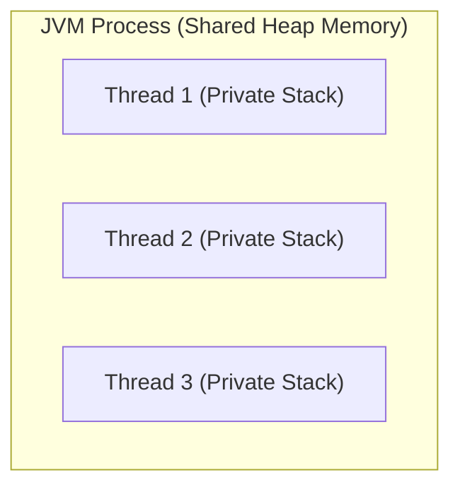
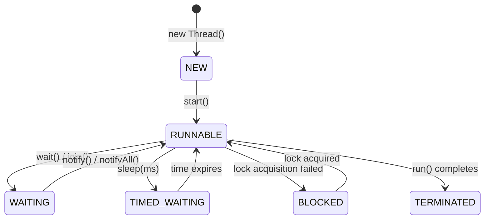
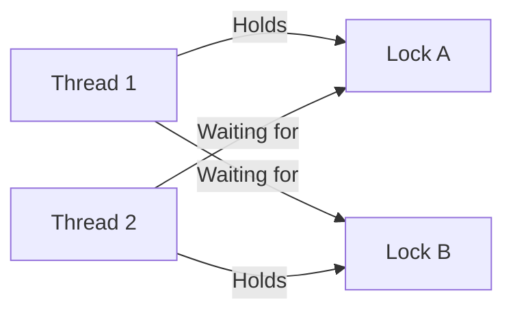

# Lecture Guide: Multithreading in Java

**Target Duration:** 60 Minutes (1 Hour)  
**Level:** Intermediate

---

## Thread Fundamentals

### Process vs. Thread

- **Process:** An independent, executing instance of a program with its own memory space (heap, stack, data segment) allocated by the OS.
- **Thread:** The smallest unit of execution within a process. Multiple threads within the same process share the heap and method area, but each maintains its own private execution stack and program counter.



---

### Thread Lifecycle & State Transitions

A Java thread moves through various states managed by the JVM thread scheduler:



---

### Creating Threads in Java

#### Method 1: Extending `Thread` Class

```java
class CustomThread extends Thread {
    @Override
    public void run() {
        System.out.println("Executing thread: " + Thread.currentThread().getName());
    }
}

public class ThreadDemo1 {
    public static void main(String[] args) {
        CustomThread t1 = new CustomThread();
        t1.start(); // Spawns a new call stack (Do NOT call run() directly)
    }
}

```

#### Method 2: Implementing `Runnable` Interface (Preferred)

Decouples thread execution logic from the class hierarchy.

```java
class TaskRunner implements Runnable {
    @Override
    public void run() {
        System.out.println("Runnable task executed by: " + Thread.currentThread().getName());
    }
}

public class ThreadDemo2 {
    public static void main(String[] args) {
        Thread t1 = new Thread(new TaskRunner(), "Worker-1");
        t1.start();

        // Lambda Syntax (Java 8+)
        Thread t2 = new Thread(() -> System.out.println("Lambda thread running"), "Worker-2");
        t2.start();
    }
}

```

---

## Thread Synchronization & Memory Visibility

### Race Conditions

A **race condition** occurs when multiple threads concurrently read and modify shared mutable data, leading to non-deterministic or corrupted states.

```java
class Counter {
    private int count = 0;

    // Critical Section
    public void increment() {
        count++; // Non-atomic: Read -> Modify -> Write
    }

    public int getCount() { return count; }
}

```

---

### Thread Synchronization (`synchronized`)

The `synchronized` keyword enforces mutual exclusion using internal object monitors (intrinsic locks). Only one thread can execute a synchronized block/method for a given object at any time.

```java
class SynchronizedCounter {
    private int count = 0;

    // Synchronized instance method locks on 'this'
    public synchronized void increment() {
        count++;
    }

    // Synchronized block with explicit object lock
    private final Object lock = new Object();
    public void safeIncrement() {
        synchronized (lock) {
            count++;
        }
    }

    public synchronized int getCount() { return count; }
}

```

---

### Memory Visibility & `volatile`

The `volatile` keyword ensures that changes made to a variable by one thread are immediately visible to all other threads by bypassing thread CPU caches and writing/reading directly to main memory.

> **Note:** `volatile` guarantees **visibility**, NOT **atomicity** (e.g., `count++` still requires synchronization or atomic classes).

```java
public class VolatileFlag implements Runnable {
    private volatile boolean running = true; // Flushes directly to main memory

    public void stop() {
        this.running = false;
    }

    @Override
    public void run() {
        while (running) {
            // Performs work until stop() is invoked from another thread
        }
        System.out.println("Worker stopped.");
    }
}

```

---

## Modern Concurrency & Deadlocks

### The Executor Framework (`java.util.concurrent`)

Manual thread creation via `new Thread()` causes high allocation overhead. The **Executor Framework** manages thread allocation using reusable thread pools.

```java
import java.util.concurrent.ExecutorService;
import java.util.concurrent.Executors;

public class ExecutorDemo {
    public static void main(String[] args) {
        // Creates a thread pool with a fixed set of 3 worker threads
        ExecutorService executor = Executors.newFixedThreadPool(3);

        for (int i = 1; i <= 5; i++) {
            final int taskId = i;
            executor.submit(() -> {
                System.out.println("Task " + taskId + " executed by " + Thread.currentThread().getName());
            });
        }

        executor.shutdown(); // Gracefully stops accepting new tasks and terminates active workers
    }
}

```

---

### `Callable` and `Future`

Unlike `Runnable.run()` which returns `void`, `Callable.call()` returns a value and can throw checked exceptions. A `Future` represents the asynchronous result of a computation.

```java
import java.util.concurrent.Callable;
import java.util.concurrent.ExecutorService;
import java.util.concurrent.Executors;
import java.util.concurrent.Future;

public class CallableDemo {
    public static void main(String[] args) throws Exception {
        ExecutorService executor = Executors.newSingleThreadExecutor();

        Callable<Integer> computationTask = () -> {
            Thread.sleep(1000);
            return 42;
        };

        Future<Integer> futureResult = executor.submit(computationTask);

        System.out.println("Doing other work while task completes...");

        // Blocking call waiting for result
        Integer result = futureResult.get();
        System.out.println("Computed Result: " + result);

        executor.shutdown();
    }
}

```

---

### Thread Deadlocks

A **deadlock** happens when two or more threads are blocked forever, waiting for locks held by each other.



#### Deadlock Prevention Strategies:

1. **Lock Ordering:** Always acquire locks in a strict, uniform sequence across all threads.
2. **Lock Timeouts:** Use `ReentrantLock.tryLock(timeout)` to avoid waiting indefinitely.
3. **Minimize Locking Scope:** Keep synchronized blocks as small as possible.

---

## Delivery Checklist & Summary Matrix

| Topic / Section         | Core Focus                                     | Key Command / Construct                 |
| ----------------------- | ---------------------------------------------- | --------------------------------------- |
| **Thread Fundamentals** | Thread vs Process, Lifecycle, & Creation       | `Thread`, `Runnable`, `.start()`        |
| **Synchronization**     | Preventing Race Conditions & Memory Visibility | `synchronized`, `volatile`              |
| **Modern Concurrency**  | Thread Pools & Asynchronous Results            | `ExecutorService`, `Callable`, `Future` |
| **Deadlocks**           | Cyclic dependencies & lock management          | Lock Ordering, `ReentrantLock`          |
