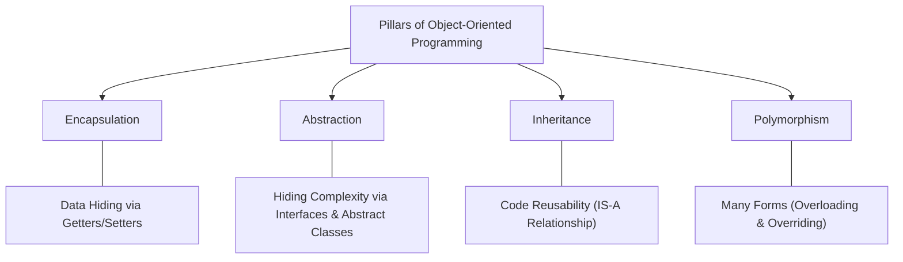
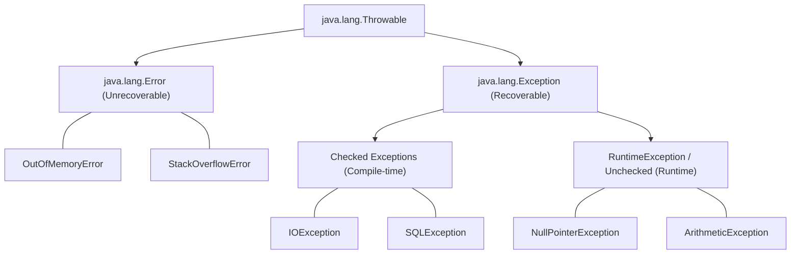

# Lecture Guide: Object-Oriented Programming (OOP) & Exception Handling in Java

**Target Duration:** 120 Minutes (2 Hours)  
**Level:** Intermediate

---

## Fundamental Pillars of OOP (40 Mins)

Object-Oriented Programming (OOP) structures applications around objects—data containers bundled with behavior—rather than functions and logic alone.



### 1. Encapsulation

Encapsulation wraps state (fields) and behavior (methods) together into a single unit (class), restricting direct access to object components using private fields and public accessors.

```java
public class BankAccount {
    // Private state hidden from direct modification
    private String accountNumber;
    private double balance;

    public BankAccount(String accountNumber, double initialBalance) {
        this.accountNumber = accountNumber;
        if (initialBalance >= 0) {
            this.balance = initialBalance;
        }
    }

    // Controlled getter
    public double getBalance() {
        return balance;
    }

    // Controlled mutator with business logic
    public void deposit(double amount) {
        if (amount > 0) {
            this.balance += amount;
        }
    }
}

```

### Access Modifiers Matrix

| Modifier                      | Class | Package | Subclass (Outside Package) | World |
| ----------------------------- | ----- | ------- | -------------------------- | ----- |
| `private`                     | Yes   | No      | No                         | No    |
| _(default / package-private)_ | Yes   | Yes     | No                         | No    |
| `protected`                   | Yes   | Yes     | Yes                        | No    |
| `public`                      | Yes   | Yes     | Yes                        | Yes   |

---

### 2. Abstraction

Abstraction exposes essential features while hiding internal operational complexity. It is achieved through **Abstract Classes** and **Interfaces**.

```java
// Interface contract defining behavior
public interface PaymentProcessor {
    boolean processPayment(double amount); // Implicitly public abstract
}

// Concrete implementation
public class CreditCardProcessor implements PaymentProcessor {
    @Override
    public boolean processPayment(double amount) {
        System.out.println("Processing credit card payment of $" + amount);
        return true;
    }
}

```

---

### 3. Inheritance

Inheritance enables a child class (subclass) to inherit attributes and methods from a parent class (superclass), promoting code reuse (`IS-A` relationship).

```java
// Superclass
public class Vehicle {
    protected String brand = "Generic";

    public void startEngine() {
        System.out.println("Engine started.");
    }
}

// Subclass
public class Car extends Vehicle {
    private int numberOfDoors;

    public Car(String brand, int doors) {
        this.brand = brand;
        this.numberOfDoors = doors;
    }
}

```

---

### 4. Polymorphism

Polymorphism allows objects to take multiple forms—treating subclass instances as superclass objects or invoking methods overridden by child classes dynamically.

```java
public class PolymorphismDemo {
    public static void main(String[] args) {
        // Polymorphic assignment
        Vehicle myVehicle = new Car("KTM", 0);

        // Calls overridden subclass implementation dynamically at runtime
        myVehicle.startEngine();
    }
}

```

---

## Advanced OOP Features

### Method Overloading vs. Method Overriding

| Feature              | Method Overloading                  | Method Overriding               |
| -------------------- | ----------------------------------- | ------------------------------- |
| **Binding Time**     | Compile-time (Static)               | Runtime (Dynamic)               |
| **Location**         | Same class                          | Subclass vs Superclass          |
| **Method Signature** | Same name, **different parameters** | **Identical name & parameters** |
| **Return Type**      | Can be different                    | Must be same or covariant       |

```java
// Overloading Example (Same class, different parameters)
public class Calculator {
    public int add(int a, int b) { return a + b; }
    public double add(double a, double b) { return a + b; }
}

// Overriding Example (Subclass modifies superclass behavior)
class Animal {
    public void makeSound() { System.out.println("Animal sound"); }
}

class Dog extends Animal {
    @Override
    public void makeSound() { System.out.println("Bark!"); }
}

```

---

## Exception Handling Mechanics

An **Exception** is an event that disrupts the normal flow of program execution. Java provides a robust mechanism to catch, handle, and recover from runtime errors.



### Checked vs. Unchecked Exceptions

- **Checked Exceptions:** Inherit directly from `Exception` (excluding `RuntimeException`). Enforced by the compiler at compile time—must be declared via `throws` or caught using `try-catch` (e.g., `IOException`, `SQLException`).
- **Unchecked Exceptions:** Inherit from `RuntimeException`. Caused by logic bugs or bad inputs. Compiler does not enforce handling (e.g., `NullPointerException`, `ArrayIndexOutOfBoundsException`).

---

### The Try-Catch-Finally Pattern

```java
public class ExceptionDemo {
    public static void main(String[] args) {
        try {
            int result = 10 / 0; // Triggers ArithmeticException
            System.out.println("Result: " + result);
        } catch (ArithmeticException e) {
            System.err.println("Error: Cannot divide by zero. " + e.getMessage());
        } catch (Exception e) {
            System.err.println("Generic fallback catch block: " + e.getMessage());
        } finally {
            // Always executes regardless of whether an exception occurred
            System.out.println("Cleanup executed (Always runs).");
        }
    }
}

```

---

## Custom Exceptions & Best Practices

### `throw` vs. `throws`

- **`throw`:** Used inside a method block to manually trigger/instantiate an exception object.
- **`throws`:** Used in a method signature to declare that the method may raise specific exceptions to its caller.

```java
public class WithdrawalService {
    // Declaring exception using 'throws'
    public void withdraw(double balance, double amount) throws IllegalArgumentException {
        if (amount > balance) {
            // Manually throwing an exception using 'throw'
            throw new IllegalArgumentException("Insufficient funds for withdrawal.");
        }
    }
}

```

---

### Creating Custom Exception Classes

Custom exceptions tailor application error scenarios to specific business domain logic.

```java
// Custom Checked Exception
public class InsufficientFundsException extends Exception {
    private double shortfall;

    public InsufficientFundsException(double shortfall) {
        super("Insufficient balance! You need $" + shortfall + " more.");
        this.shortfall = shortfall;
    }

    public double getShortfall() {
        return shortfall;
    }
}

```

---

## Delivery Checklist & Summary Matrix

| Section / Activity    | Core Focus & Teaching Goal                                 | Key Output                      |
| --------------------- | ---------------------------------------------------------- | ------------------------------- |
| **OOP Pillars**       | Encapsulation, Abstraction, Inheritance, and Polymorphism  | Object-oriented design thinking |
| **Advanced OOP**      | Overloading vs Overriding & method mechanics               | Polymorphic code design         |
| **Exception Basics**  | Exception hierarchy and `try-catch-finally` structure      | Fault-tolerant programming      |
| **Custom Exceptions** | Custom error types, `throw`/`throws`, & Try-With-Resources | Production-grade error handling |
