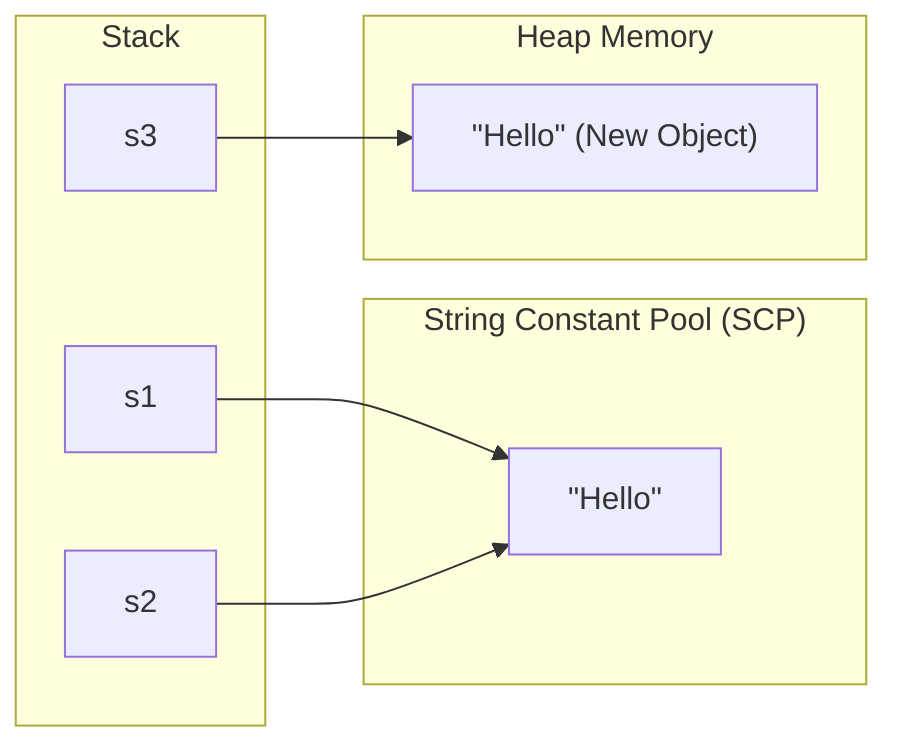

# Lecture Guide: Strings, Collections & Utilities in Java

**Target Duration:** 120 Minutes (2 Hours)  
**Level:** Intermediate

---

## Strings in Java

### String Immutability & The String Constant Pool

In Java, `String` objects are **immutable**—once created, their value cannot be changed. String literals are stored in a special memory area within the Heap known as the **String Constant Pool (SCP)** to optimize memory usage.



```java
public class StringPoolDemo {
    public static void main(String[] args) {
        String s1 = "Hello";                  // Created in String Constant Pool
        String s2 = "Hello";                  // Reuses reference from SCP
        String s3 = new String("Hello");      // Forces creation of a new Heap object

        System.out.println(s1 == s2);         // true (Same reference)
        System.out.println(s1 == s3);         // false (Different references)
        System.out.println(s1.equals(s3));    // true (Content comparison)
    }
}

```

### `String` vs. `StringBuilder` vs. `StringBuffer`

| Feature           | `String`               | `StringBuilder`               | `StringBuffer`              |
| ----------------- | ---------------------- | ----------------------------- | --------------------------- |
| **Mutability**    | Immutable              | Mutable                       | Mutable                     |
| **Thread Safety** | Thread-safe            | **Not** Thread-safe           | Thread-safe (Synchronized)  |
| **Performance**   | Slow (Creates objects) | **Fastest** (Single-threaded) | Slower (Overhead from sync) |

```java
public class StringBuilderDemo {
    public static void main(String[] args) {
        StringBuilder sb = new StringBuilder("Java");
        sb.append(" Programming");
        sb.insert(4, " Core");
        sb.reverse();

        System.out.println(sb.toString());
    }
}

```

### Essential String Manipulation Methods

```java
String text = "   Java Programming Language   ";

System.out.println(text.length());              // 31
System.out.println(text.trim());                // Removes leading/trailing whitespace
System.out.println(text.substring(3, 7));       // "Java"
System.out.println(text.contains("Program"));   // true
System.out.println(text.replace('a', 'o'));    // Replaces character occurrences
String[] words = text.trim().split(" ");        // Splits into array of strings

```

---

## Java Collections Framework (JCF)

The **Java Collections Framework** provides a unified architecture for representing and manipulating groups of objects.

### 1. The List Interface (Ordered, Allows Duplicates)

- **`ArrayList`:** Backed by a dynamic array. Fast random access $O(1)$, slow insertion/deletion in the middle $O(n)$.
- **`LinkedList`:** Doubly-linked list implementation. Fast insertions/deletions $O(1)$, slower random access $O(n)$.

```java
import java.util.ArrayList;
import java.util.List;

public class ListDemo {
    public static void main(String[] args) {
        List<String> fruits = new ArrayList<>();
        fruits.add("Apple");
        fruits.add("Banana");
        fruits.add("Apple"); // Allows duplicates

        System.out.println("Element at index 1: " + fruits.get(1));

        for (String fruit : fruits) {
            System.out.println(fruit);
        }
    }
}

```

### 2. The Set Interface (Unordered, Unique Elements)

- **`HashSet`:** Backed by a HashMap. Guarantees no duplicates; provides $O(1)$ time complexity for fundamental operations. Unordered.
- **`TreeSet`:** Red-Black tree implementation. Keeps elements sorted according to natural ordering or a custom `Comparator`. $O(\log n)$ access.

```java
import java.util.HashSet;
import java.util.Set;
import java.util.TreeSet;

public class SetDemo {
    public static void main(String[] args) {
        Set<String> uniqueNames = new HashSet<>();
        uniqueNames.add("Rahul");
        uniqueNames.add("Julia");
        uniqueNames.add("Julia"); // Duplicate ignored

        System.out.println("HashSet (Unordered): " + uniqueNames);

        Set<Integer> sortedNumbers = new TreeSet<>(Set.of(42, 10, 5, 99));
        System.out.println("TreeSet (Sorted): " + sortedNumbers); // [5, 10, 42, 99]
    }
}

```

### 3. The Map Interface (Key-Value Pairs, Keys Unique)

- **`HashMap`:** Key-value mapping. Allows one `null` key and multiple `null` values. Unordered.
- **`TreeMap`:** Sorted key-value pairs ordered by key.

```java
import java.util.HashMap;
import java.util.Map;

public class MapDemo {
    public static void main(String[] args) {
        Map<Integer, String> studentMap = new HashMap<>();
        studentMap.put(101, "Rahul");
        studentMap.put(102, "Julia");
        studentMap.put(103, "Charlie");

        // Iterating over key-value entries
        for (Map.Entry<Integer, String> entry : studentMap.entrySet()) {
            System.out.println("ID: " + entry.getKey() + " | Name: " + entry.getValue());
        }
    }
}

```

---

## Wrapper Classes

Wrapper classes wrap primitive data types into object equivalents, enabling primitive values to be used in generic Collection classes.

| Primitive Type | Wrapper Class |
| -------------- | ------------- |
| `byte`         | `Byte`        |
| `short`        | `Short`       |
| `int`          | `Integer`     |
| `long`         | `Long`        |
| `float`        | `Float`       |
| `double`       | `Double`      |
| `char`         | `Character`   |
| `boolean`      | `Boolean`     |

### Autoboxing & Unboxing

- **Autoboxing:** Automatic conversion of a primitive type into its corresponding wrapper object.
- **Unboxing:** Automatic conversion of a wrapper object into its corresponding primitive type.

```java
import java.util.ArrayList;
import java.util.List;

public class WrapperDemo {
    public static void main(String[] args) {
        int primitiveNum = 25;

        // Autoboxing
        Integer wrappedNum = primitiveNum;

        List<Integer> numberList = new ArrayList<>();
        numberList.add(100); // Autoboxing primitive int 100 to Integer object

        // Unboxing
        int value = numberList.get(0); // Converts Integer object back to primitive int

        // Utility Methods in Wrapper Classes
        int parsed = Integer.parseInt("12345");
        String binaryStr = Integer.toBinaryString( parsed );
        boolean isDigit = Character.isDigit('7');

        System.out.println("Parsed: " + parsed + " | Binary: " + binaryStr);
    }
}

```

---

## Utility Classes

### 1. `java.util.Arrays`

Provides static utility methods for manipulating native arrays.

```java
import java.util.Arrays;

public class ArraysUtilDemo {
    public static void main(String[] args) {
        int[] numbers = {5, 2, 8, 1, 9};

        Arrays.sort(numbers);                               // Sorts array in-place
        System.out.println(Arrays.toString(numbers));        // [1, 2, 5, 8, 9]

        int index = Arrays.binarySearch(numbers, 5);         // Returns index of element
        System.out.println("Index of 5: " + index);

        int[] copiedArray = Arrays.copyOf(numbers, 3);       // Truncates or expands
        System.out.println(Arrays.toString(copiedArray));   // [1, 2, 5]
    }
}

```

### 2. `java.util.Collections`

Provides polymorphic algorithms operating directly on collection types.

```java
import java.util.ArrayList;
import java.util.Collections;
import java.util.List;

public class CollectionsUtilDemo {
    public static void main(String[] args) {
        List<String> list = new ArrayList<>(List.of("C", "A", "B", "E", "D"));

        Collections.sort(list);              // Sorts list
        Collections.reverse(list);           // Reverses list
        Collections.shuffle(list);           // Randomly shuffles list

        String max = Collections.max(list);  // Finds maximum element
        String min = Collections.min(list);  // Finds minimum element
    }
}

```

### 3. Modern Date & Time API (`java.time`)

Introduced in Java 8 to replace legacy, mutable `java.util.Date` and `java.util.Calendar`.

```java
import java.time.LocalDate;
import java.time.LocalDateTime;
import java.time.LocalTime;
import java.time.format.DateTimeFormatter;

public class DateTimeDemo {
    public static void main(String[] args) {
        LocalDate today = LocalDate.now();
        LocalTime now = LocalTime.now();
        LocalDateTime currentDateTime = LocalDateTime.now();

        LocalDate futureDate = today.plusDays(30);

        DateTimeFormatter formatter = DateTimeFormatter.ofPattern("dd-MM-yyyy HH:mm:ss");
        String formattedDate = currentDateTime.format(formatter);

        System.out.println("Today: " + today);
        System.out.println("Formatted Date: " + formattedDate);
    }
}

```

---

## Delivery Checklist & Summary Matrix

| Section / Activity        | Core Focus & Teaching Goal                                | Key Output                          |
| ------------------------- | --------------------------------------------------------- | ----------------------------------- |
| **Strings**               | String Pool, Immutability & StringBuilder vs StringBuffer | Memory understanding & optimization |
| **Collections Framework** | List, Set, and Map interfaces with implementations        | Data structure selection skills     |
| **Wrapper Classes**       | Autoboxing/Unboxing mechanics & parsing primitives        | Object-primitive bridge mastery     |
| **Utility Classes**       | Operations with `Arrays`, `Collections`, & `java.time`    | Clean, efficient code practices     |
