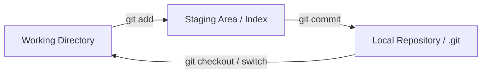
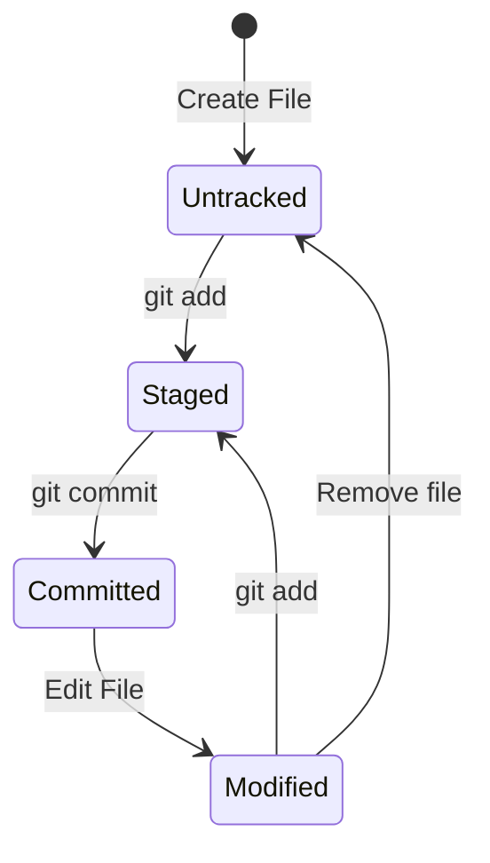

```mermaid
graph LR
    A[Working Directory] -- "git add" --> B[Staging Area / Index]
    B -- "git commit" --> C[Local Repository / .git]
    C -- "git checkout / switch" --> A

```

```mermaid
stateDiagram-v2
    [*] --> Untracked: Create File
    Untracked --> Staged: git add
    Staged --> Committed: git commit
    Committed --> Modified: Edit File
    Modified --> Staged: git add
    Modified --> Untracked: Remove file

```
