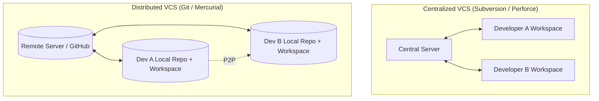

```mermaid
graph TD
    subgraph CVCS ["Centralized VCS (Subversion / Perforce)"]
        A[Central Server] <--> B[Developer A Workspace]
        A <--> C[Developer B Workspace]
    end

    subgraph DVCS ["Distributed VCS (Git / Mercurial)"]
        D[(Remote Server / GitHub)] <--> E[(Dev A Local Repo + Workspace)]
        D <--> F[(Dev B Local Repo + Workspace)]
        E -. "P2P" .-> F
    end

```
