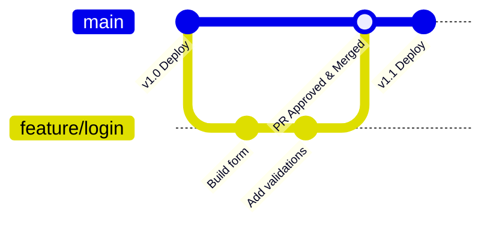
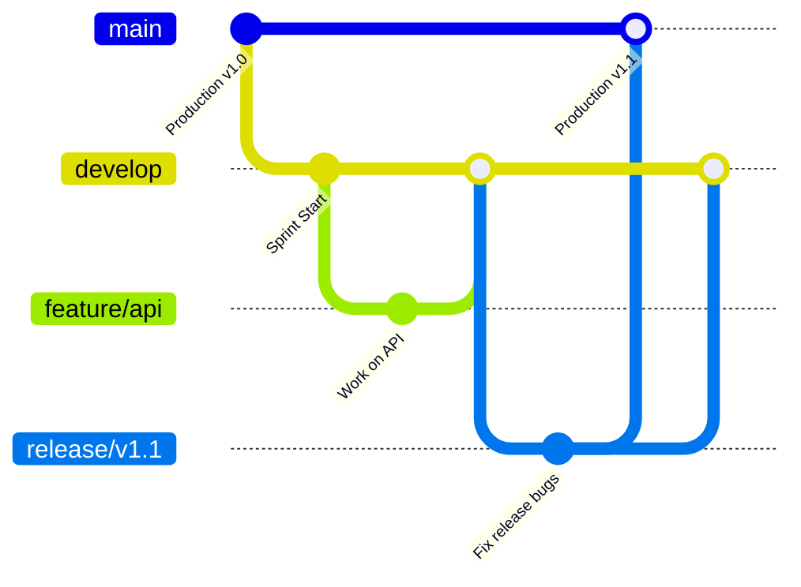

```mermaid
gitGraph
   commit id: "v1.0 Deploy"
   branch feature/login
   checkout feature/login
   commit id: "Build form"
   commit id: "Add validations"
   checkout main
   merge feature/login id: "PR Approved & Merged"
   commit id: "v1.1 Deploy"

```

```mermaid
gitGraph
   commit id: "Production v1.0"
   branch develop
   checkout develop
   commit id: "Sprint Start"

   branch feature/api
   checkout feature/api
   commit id: "Work on API"

   checkout develop
   merge feature/api

   branch release/v1.1
   checkout release/v1.1
   commit id: "Fix release bugs"

   checkout main
   merge release/v1.1 id: "Production v1.1"

   checkout develop
   merge release/v1.1

```
