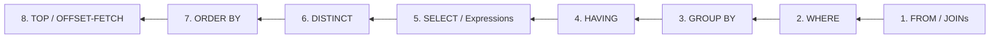
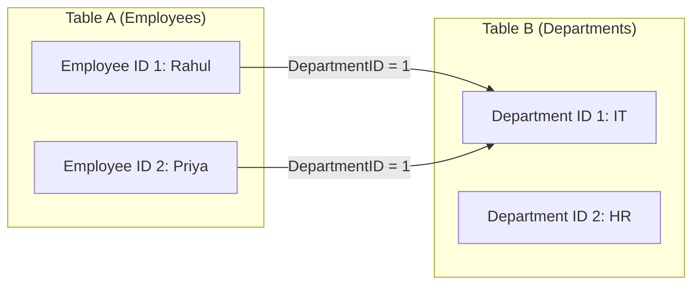
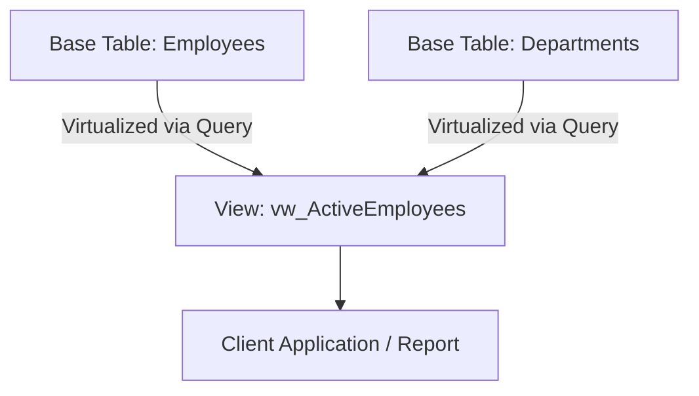
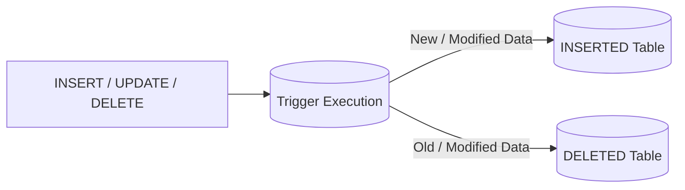

```mermaid
flowchart RL
    A[1. FROM / JOINs] --> B[2. WHERE]
    B --> C[3. GROUP BY]
    C --> D[4. HAVING]
    D --> E[5. SELECT / Expressions]
    E --> F[6. DISTINCT]
    F --> G[7. ORDER BY]
    G --> H[8. TOP / OFFSET-FETCH]

```

```mermaid
graph LR
    subgraph "Table A (Employees)"
        A1[Employee ID 1: Rahul]
        A2[Employee ID 2: Priya]
    end
    subgraph "Table B (Departments)"
        B1[Department ID 1: IT]
        B2[Department ID 2: HR]
    end
    A1 -->|DepartmentID = 1| B1
    A2 -->|DepartmentID = 1| B1

```

```mermaid
graph TD
    A[Base Table: Employees] -->|Virtualized via Query| C[View: vw_ActiveEmployees]
    B[Base Table: Departments] -->|Virtualized via Query| C
    C --> D[Client Application / Report]

```

```mermaid
flowchart LR
    DML[INSERT / UPDATE / DELETE] --> IT[(Trigger Execution)]
    IT -->|New / Modified Data| INS[(INSERTED Table)]
    IT -->|Old / Modified Data| DEL[(DELETED Table)]

```
